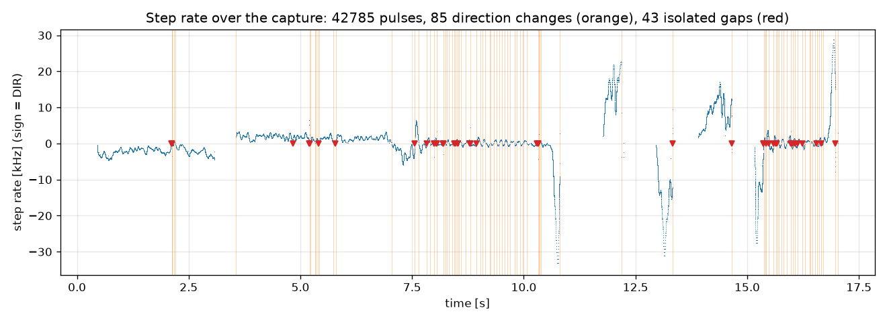
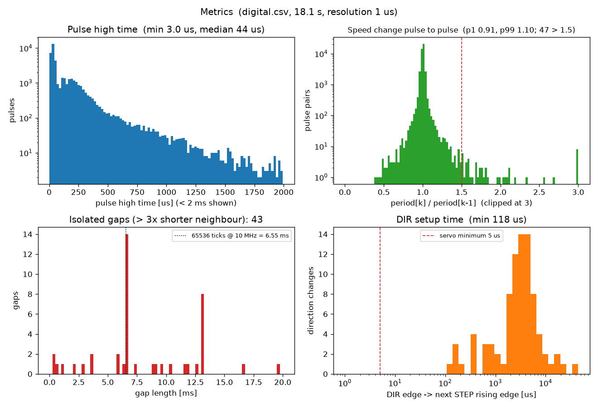
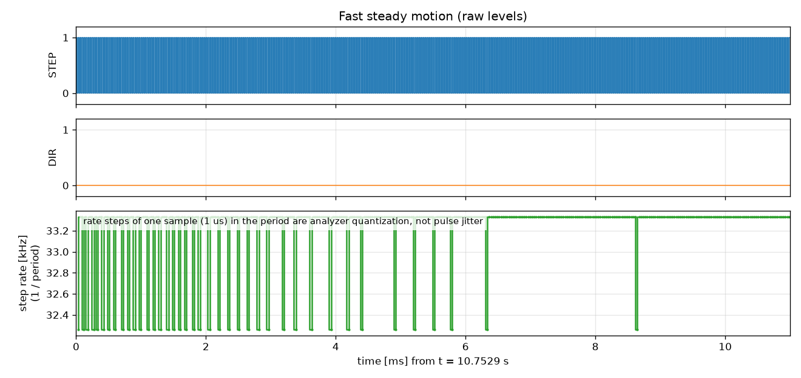
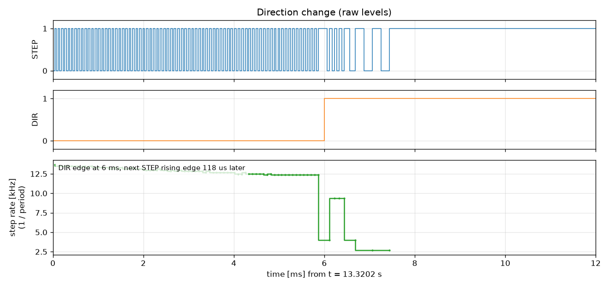
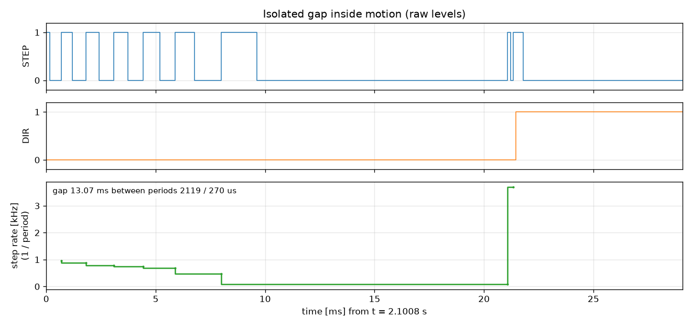

# STEP/DIR logic analyzer analysis

This folder holds tools and a reference result for checking the pulse train that the pedal firmware sends to the
iSV57 servo. The pulses are generated by the FastNonAccelStepper library.

| File | Purpose |
|---|---|
| [analyze_logic_trace.py](analyze_logic_trace.py) | Computes the metrics below and prints a text report. Standard library only. |
| [plot_logic_trace.py](plot_logic_trace.py) | Generates the images in [images/](images/). Needs `matplotlib` and `numpy`. |

| [analyze_session.py](analyze_session.py) | Combines a capture with a SimHub state log of the same session (see [below](#combined-session-analysis)). Needs `matplotlib` and `numpy`. |
| [analyze_ripple.py](analyze_ripple.py) | Rotation-locked ripple in the step command, for comparing captures (see [below](#reference-rotation-locked-ripple-2026-10-07)). Needs `numpy`. |

```
python analyze_logic_trace.py path/to/digital.csv
python plot_logic_trace.py    path/to/digital.csv [output_dir]
python analyze_session.py     path/to/DiyFfbPedalStateLog_*.txt path/to/digital.csv [output_dir]
python analyze_ripple.py      path/to/digital.csv [more captures ...]
```

## Recording a capture

- Connect the logic analyzer to the STEP and DIR signals on the pedal board, which are the inputs of the servo.
- Record while pressing the pedal the way you want to test: slow, fast, direction changes, holding.
- In Saleae Logic 2, choose *Export Data → CSV*. The result is `digital.csv`, with one row per level change:

  ```
  Time [s],Channel 2,Channel 3
  0.000000000,1,0
  0.447094000,0,0
  ```

  The channel names don't matter: the script takes the channel with the most transitions as STEP and the other as
  DIR.
- Use a high sample rate. At 30 kHz a step period is only about 33 µs, so a 1 µs sample period already shows up as
  ±1 µs (±3 %) steps in the measured rate. A sample rate of 10 MHz or more removes this.

## How the metrics are calculated

The script first turns the CSV rows into a list of edges per channel. All metrics are time differences between
edges.

| Metric | Calculation | What it shows |
|---|---|---|
| **Sample period** | Greatest common divisor of all timestamps | Time resolution of the capture. Every time below is uncertain by ±1 sample. |
| **Shortest edge spacing** | Smallest time between any two consecutive edges | Usually the shortest step pulse. It is a property of the signal, not of the analyzer. |
| **Pulse high time** | Rising STEP edge → next falling STEP edge | Must stay above the minimum pulse width. The library guarantees 3 µs. Very long values are standstill with STEP left high. |
| **Period** | Rising STEP edge → next rising STEP edge. 1/period is the momentary step rate. | Basis for everything below. |
| **Period ratio** | period[k] / period[k−1], only when both periods are under 5 ms (above 200 Hz, "in motion") | Speed change from one pulse to the next. The report gives the 1 % and 99 % values; 0.91 / 1.10 means 98 % of pulses are within about ±10 % of the previous one. |
| **Sudden slow-downs** | Number of period ratios above 1.5 | Pulses that come at least 50 % later than the previous rate would predict. |
| **Isolated gaps** | Period that is (a) more than 3× its **shorter** neighbour period, (b) shorter than 20 ms, and (c) next to a period under 2 ms | Short stops or dropouts while the pedal is moving. Because only the shorter neighbour is compared, a slow-down followed by a restart also counts. |
| **DIR setup time** | DIR edge → next rising STEP edge | The servo needs at least 5 µs before it counts the first step in the new direction. |
| **DIR while STEP high** | The last STEP pulse before a DIR edge is still high when DIR changes | Harmless here: the iSV57 and the ESP32 position counter (PCNT) both count on the **rising** STEP edge. |

**Limits.** The capture only shows what was sent to the servo. It can't tell whether a stop or a speed jump was
*requested* by the control loop (for example a real stop at a direction change) or is a pulse-generation glitch.
To decide that, record the SimHub state log (debug flag 64/68) at the same time and compare.

## Reference result

This capture was taken on 2026-09-30 with FastNonAccelStepper v0.1.1 on a V7 board, and lasts 18.1 s:

```
sample period (time resolution): 1000 ns, shortest spacing between edges: 3000 ns
step rising edges: 42785
high time: min 3.00 us, p1 15.00, median 44.00, max 965980.0 us
consecutive period ratio >1.5 (sudden slow-down inside motion): 47 of 42566 (0.11 %)
period ratio p1 0.91, p99 1.10
isolated gaps inside motion (period > 3x shorter neighbour): 43
   gap length histogram (ms): 0.3:2, 0.6:1, 1.1:1, 2.2:1, 2.9:1, 3.6:1, 3.7:1, 5.8:1, 6.0:1, 6.5:13, 6.6:2, ...
direction changes: 85
DIR change -> next step rising edge: min 118.00 us, median 3207.0 us
   setups < 5 us: 0 of 85
DIR changed while a step pulse was high: 12
```

For comparison, a capture with FastNonAccelStepper v0.1.0 had 0.12 % sudden slow-downs. Before the pulse
generator rework, 10.3 % of pulses in the 2–3.3 kHz range had gaps.

### Overview



- The plot shows the step rate over time: 1/period, with the sign taken from the DIR level (DIR high = positive).
- Orange lines are direction changes. Red markers are isolated gaps.
- The gaps are all near zero rate, i.e. during slow creeping and around direction changes, not during fast
  strokes.

### Metrics



- **Pulse high time:** STEP runs at 50 % duty cycle, so the high time is half the period. The minimum is the
  library's 3 µs minimum pulse width.
- **Pulse-to-pulse speed change:** a narrow peak at 1.0. Only 47 pairs lie beyond the 1.5 line.
- **Gap lengths:** a cluster at 6.54–6.55 ms. That equals 65 536 timer ticks at 10 MHz, the longest period the
  MCPWM timer can produce, i.e. the slowest step rate (about 153 Hz). These "gaps" are therefore the generator
  running at its lowest speed, not dropouts. Longer gaps (such as the group at 13 ms) are real short stops,
  where the pulse output was switched off and restarted.
- **DIR setup time:** every direction change leaves at least 118 µs before the next step, far above the 5 µs the
  servo needs.

### Raw waveforms

**Fast steady motion** at about 33 kHz. The rate appears to jump between 32.3 and 33.3 kHz, but that is the
1 µs sample period: a period of about 30.3 µs gets measured as either 30 or 31 µs. The pulses themselves are
regular.



**Direction change** during motion. The script picks the one with the least time between the pulses before and
after the change. DIR switches while the last pulse is still high.
The first rising edge in the new direction follows 118 µs later.



**Isolated gap.** The rate falls from about 1 kHz to a stop. After 13 ms two quick pulses follow at about
3.7 kHz, then DIR changes. This most likely comes from the step command: a stop near the target, then the
standstill position correction with its minimum speed. Only a simultaneous state log can confirm it.



## Combined session analysis

[analyze_session.py](analyze_session.py) combines a logic analyzer capture with a SimHub state log
that was recorded at the same time. Record the log with debug flag 64 (every cycle) or 68 (1 kHz).
Default output: an `analysis` folder next to the capture.

**Alignment.** The log column `targetPosition_i32` is the ESP32 pulse counter at the start of each
control cycle, and the capture contains every pulse.
1. The script cross-correlates the two velocity profiles for a coarse time offset. The same step
   decides which DIR level means "forward".
2. It refines the offset and the clock drift until the logged counter matches the captured pulse
   count. It reports how often the two agree to ±1 pulse. The rest are pulses in flight during a
   cycle, which get more frequent at high speed.

**Model setpoint.** The admittance model's position (`admittance_virtualPosition_m`, in task space)
is mapped to steps with a cubic fit. The fit uses only the samples where the pedal moves slowly.

| Output | Content |
|---|---|
| **Task cycle time** | Time between consecutive logged cycles. Rows where the USB stream skipped cycles are excluded. Compared against the lead budget of the step command (3 cycles = 750 µs). |
| **Servo following lag** | Servo following error ÷ servo target speed, fitted on the Modbus servo data (~100 Hz). |
| **Delivered vs commanded rate** | Pulses counted in 2 / 10 / 20 ms windows, compared with the change of the model setpoint in the same window. The ±1 pulse counting limit is drawn for reference. |
| **Pulse gaps at speed** | Isolated gaps (see above) while the model moves faster than 2 kHz. Each one is classified:<br>*end of travel*: the pulses stop at the travel end, as expected.<br>*late cycle*: a cycle close to or longer than the lead budget ran out of lead.<br>*other*. |

Plots: `1_overview.png` (force, commanded vs delivered step rate, cycle time), `2_task_timing.png`,
`3_pulse_accuracy.png`, `4_where_pulses_stop.png` (the fastest gap of each kind), `5_servo_lag.png`.

### Reference: effect of the step command changes (2026-09-30)

Two throttle sessions were recorded with the same pedal. The first used a lead of 2 cycles and clipped
the target only at the hard endstop. The second used a lead of 3 cycles and stops the lead at the end
of the travel range.

| | Before (20:14) | After (20:28) |
|---|---|---|
| Longest task cycle | 713 µs | 716 µs |
| Gaps caused by a late cycle | 1 (199 µs gap at 17.7 kHz, after a 641 µs cycle) | 0 |
| Arrivals at full travel at 6–28 kHz: overshoot, then a reversal | 9 of 9 arrivals, 2–7 steps | 0 of 3 arrivals |
| Arrivals at the pulse speed limit (38–107 kHz requested) | – | 2–5 steps overshoot, then a reversal (about 6–14 µm) |
| Servo following lag | 14.6 ms | 13.8 ms |

### Reference: clean direction reversals (FastNonAccelStepper v0.1.2)

At a direction change DIR must not switch while a STEP pulse is high. Otherwise the pulse's rising and
falling edge see different DIR levels, and two counters that use different edges count that pulse in
opposite directions. The ESP32 pulse counter (PCNT) and the servo are such a pair. Each event shifts the
two positions apart by 2 steps. The capture shows this as "DIR changed while STEP was high", which should
be 0.

At standstill STEP rests HIGH, because the MCPWM timer stops at the start of a period.

The combined session analysis also shows the effect directly. Compare the logged ESP32 counter with the
captured pulses at each standstill: the offset between the two must not drift over the session.

| Session (8 MS/s) | Library | DIR changed while STEP was high | Net drift ESP32 vs pulses | First pulse after a reversal |
|---|---|---|---|---|
| 20:31 | v0.1.1 | 19 of 26 | −6 steps | 0.5–3.3 periods of the new speed |
| 20:54 | v0.1.2 draft (waits for the period end) | 0 of 27 | 0 | ~6.8 ms (too late) |
| 21:02 | v0.1.2 | 0 of 26 | 0 | 0.7–2.5 periods |

A back-and-forth of ±2 steps between individual standstills remains, without any drift. It already
appeared with the old library and is linked to the unfinished pulse left at every stop.

### Reference: rotation-locked ripple (2026-10-07)

The throttle felt less smooth than at the end of September. The capture showed a clean pulse train
(period ratio p1/p99 0.97/1.03, no DIR change while STEP was high). The roughness was in the
trajectory the admittance model commanded:

- While the servo moves, the load cell force carries a ripple of about 24 cycles per motor
  revolution (13–15 g rms, 40–60 Hz at 5–8 kHz step rate). At rest it is 1–2 g; held at full
  travel with 7 kg it is 2–4 g. It comes from the drivetrain, not from the firmware.
- The model turns this force into steps. The measured force-to-step transfer matches the model
  (coherence 0.99 at 50 Hz).
- The contact damping term adds `+4 ms · dF/dt` since 2026-10-01. Before, it subtracted it. At
  50 Hz the force input now has a gain of 1.44, against 0.59 before.

[analyze_ripple.py](analyze_ripple.py) measures the ripple in the step command: rms of orders 20–30
per motor revolution, in 200 ms windows at 3–9 kHz step rate.

| Capture | Firmware | Ripple [steps rms] |
|---|---|---|
| 2026-09-30, five sessions | `- tau · dF/dt` | 2.9–3.7 |
| 2026-10-07 | `+ tau · dF/dt` | 7.4 |

The sign of the term can be set with the build flag `CONTACT_DAMPING_DERIV_SIGN` (+1, −1, 0) in
`StepperMovementStrategy.h` for A/B tests. A/B test, same pedal and config, each with presses and
a heel hold at ~3 kg:

| `CONTACT_DAMPING_DERIV_SIGN` | Ripple [steps rms] | Heel hold |
|---|---|---|
| +1 | 6.5 | calm (force 7 g at 9 Hz), contact oscillation detector never triggered |
| −1 | 2.9 | 20 Hz contact oscillation (57 g), detector triggered, damping raised to 3x |
| 0 | 4.9 | detector triggered for 5 s, damping raised to 3x |

The sign trades the ripple during strokes against stability of a held heel contact. By feel, the
three variants could not be told apart: the sign only changes how much of the ripple enters the
step command, not the ripple itself.

**Actual cause: the servo's torque filter.** The ripple is the motor's torque ripple at 6 × the
electrical frequency (4 pole pairs, Pr7.05, so 24 per revolution). Only the servo's velocity loop
(Pr1.01 = 400, i.e. 40 Hz) can reject it, and the 1st torque filter Pr1.04 (unit 0.01 ms) sits
inside that loop. Raising Pr1.04 from 100 to 180 (1.8 ms, on 2026-09-10) added about 30° of lag at
50 Hz, and the pedal felt rough. With Pr1.04 = 20 (0.2 ms) it feels clearly smoother. At 7–12 kHz
step rate the force ripple dropped from 128 g to 57 g.

A higher velocity loop gain (Pr1.01 = 800) made the servo loud: broadband 270–2000 Hz encoder noise.
Combinations of a higher Pr1.01 with a larger Pr1.04 felt less smooth than 400 / 20.
