# iSV57 Servo Control Loops: Signal Flow and Feedback Latency

How the iSV57 turns the ESP32 step pulses into motor torque, where its gains and filters act, and which
settings decide how quickly the servo feedback position follows the ESP command.

Parameter values: [`ESP32/include/isv57_tunedParameters.h`](../../ESP32/include/isv57_tunedParameters.h).
The structure follows the Panasonic MINAS-A5 parameter map, which the iSV57 mirrors.

> **The loop gains and filters in that table are not written by the firmware.**
> `sendTunedServoParameters` ([`isv57communication.cpp`](../../ESP32/src/isv57communication.cpp)) writes only
> Pr0.00/0.01/0.06/0.08/0.09/0.10/0.14, Pr1.37, Pr4.10, Pr5.20, Pr5.35 and Pr7.00/7.01/7.31/7.33, plus Pr7.32 and
> Pr2.22 through their setters. Everything else (Pr1.00–1.13, the Pr2.xx filters, Pr6.11, Pr6.23/6.24) comes from
> the servo's NVM, as set with the Stepperonline app, and can differ from the table. Read the real values in
> the Stepperonline app before tuning.

---

## 1. Signal flow

To render the diagram in VS Code, install the **Markdown Preview Mermaid Support** extension
(`bierner.markdown-mermaid`) and open the Markdown preview (`Ctrl+Shift+V`).

Colour key:

| Colour | Meaning |
|---|---|
| purple | ESP32 side |
| blue | command path, outside the loop: coherent, pure delay |
| orange | filter inside the loop: adds phase lag at crossover and caps Kp / Kv |
| grey | inactive, or practically inactive, in the current setting |

Units follow the Panasonic MINAS-A5 parameter map, e.g. Pr1.10/1.12 in 0.1 %, Pr1.00 in 0.1 s⁻¹, Pr1.01 in
0.1 Hz, Pr1.02 and Pr2.22/2.23 in 0.1 ms, Pr1.04/1.11/1.13/6.24 in 0.01 ms. Pr6.24 = 15 is therefore 0.15 ms,
not the 1.5 ms its table comment says; check this against the iSV57 manual.

```mermaid
flowchart LR
  subgraph ESP["ESP32 (1.6–4 kHz loop)"]
    ADM["Admittance model<br/>target position"]
    LEAD["Step command<br/>+3-cycle lead"]
    PULSE["Step pulses<br/>≤117 kHz in a fast press"]
    ADM --> LEAD --> PULSE
  end

  subgraph CMD["Command path (outside the loop)"]
    PIN["Pr1.35 pulse input filter = 0"]
    GEAR["Pr0.08 3200 steps/rev<br/>Pr0.09/0.10 e-gear 1:1"]
    PT1["Pr2.22 PT1 smoothing<br/>0.8 ms"]
    FIR["Pr2.23 FIR moving average<br/>0.5 ms"]
    PIN --> GEAR --> PT1 --> FIR
  end
  PULSE --> PIN

  FIR -->|"θ*"| DIFF1["d/dt"]
  FIR -->|"θ*"| PERR(("θ* − θ"))
  FIR -->|"θ*"| DIFF2["d²/dt²"]

  subgraph FF["Feedforward"]
    VFF["Pr1.10 velocity FF 3.5 % (≈ off)<br/>Pr1.11 filter 0"]
    TFF["Pr1.12 torque FF 0 % (off)<br/>Pr1.13 filter 10 ms<br/>Pr0.04 inertia ratio 110 %"]
  end
  DIFF1 --> VFF
  DIFF2 --> TFF

  subgraph PLOOP["Position loop"]
    KP["Pr1.00 Kp 60 s⁻¹<br/>Pr1.28 integral 1000 ms ≈ off<br/>Pr1.29 D = 0"]
  end
  PERR --> KP
  KP --> VSUM(("Σ ω*"))
  VFF --> VSUM

  subgraph VLOOP["Velocity loop"]
    VERR(("ω* − ω̂"))
    PI["PI: Pr1.01 Kv 40 Hz<br/>× J·(1 + Pr0.04 110 %)<br/>Pr1.02 Ti 20 ms"]
    VDET["Pr1.03 velocity<br/>detection filter 27"]
    VERR --> PI
  end
  VSUM --> VERR

  PI --> TSUM(("Σ torque"))
  TFF --> TSUM

  subgraph TPATH["Torque path"]
    DOB["Pr6.23 disturbance observer 30 %<br/>Pr6.24 filter 15<br/>(0.15 ms in A5 units)"]
    TFILT["Pr1.04 torque filter<br/>1.8 ms"]
    NOTCH["Pr2.01 notch 50 Hz · Pr2.04 notch 90 Hz<br/>width 20 · depth 99"]
    TLIM["Pr0.13 torque limit 500 %"]
    TFILT --> NOTCH --> TLIM
  end
  TSUM --> TFILT
  DOB -->|"− compensation"| TSUM

  subgraph CUR["Current loop"]
    IL["Pr7.00 gain 500 · Pr7.01 Ti 50<br/>Pr6.11 current response 50 %"]
  end
  TLIM --> IL

  subgraph MECH["Mechanics"]
    MOT["Motor<br/>Pr7.09 Kt · Pr7.13 rotor inertia"]
    LOAD["5 mm spindle → sled<br/>→ pedal → foot"]
    MOT --> LOAD
  end
  IL --> MOT

  ENC["Encoder θ<br/>Pr1.36 filter = 0"]
  LOAD --> ENC
  ENC -->|"θ"| PERR
  ENC --> DIFF3["d/dt"] --> VDET -->|"ω̂"| VERR
  ENC -.->|"ω̂, torque"| DOB

  subgraph OFF["Inactive in this setting"]
    G2["Pr1.05–1.09 2nd gain set<br/>Pr1.15 = 0: switching off"]
    AUTO["Pr0.02 real-time auto-tuning off<br/>Pr2.00 adaptive notch off"]
    DAMP["Pr2.14–2.17 vibration damping<br/>freq 0 = off"]
  end

  subgraph SAFE["Limits and protection"]
    DEV["Pr0.14 deviation limit 500<br/>Er180 masked via Pr1.37 bit 0x08"]
    SPD["Pr3.24 max speed 5000 rpm<br/>Pr5.13 over-speed 5000"]
    BLEED["Pr7.31/7.32 bleeder at 40 V"]
  end

  ENC -.->|"Modbus ~100 Hz,<br/>~7.6 ms readout delay"| TEL["Telemetry:<br/>servo target / feedback"]

  classDef esp fill:#ede7f6,stroke:#5e35b1,color:#1a1a1a
  classDef cmd fill:#e3f2fd,stroke:#1e88e5,color:#1a1a1a
  classDef ff fill:#e8f5e9,stroke:#43a047,color:#1a1a1a
  classDef lag fill:#fff3e0,stroke:#fb8c00,color:#1a1a1a
  classDef off fill:#eeeeee,stroke:#9e9e9e,color:#616161
  classDef loop fill:#ffffff,stroke:#424242,color:#1a1a1a
  class ADM,LEAD,PULSE,TEL esp
  class PIN,GEAR,PT1,FIR cmd
  class VFF,TFF,G2,AUTO,DAMP off
  class VDET,TFILT,NOTCH,DOB,IL lag
  class KP,PI,TLIM,MOT,LOAD,ENC,DEV,SPD,BLEED loop
```

---

## 2. Do the filters break feedforward/feedback coherence?

It depends on where each filter sits:

| Where | Parameters | Effect |
|---|---|---|
| Command path, before the split into feedforward and feedback | Pr1.35, Pr2.22, Pr2.23 | Pure delay (~1 ms here). Both paths see the same signal, so stacking them cannot cause overshoot. **This is the right place for any smoothing.** |
| Feedforward only | Pr1.11, Pr1.13 | Delays the feedforward relative to the feedback. This is where incoherence comes from. Pr1.11 = 0 is correct. Pr1.13 = 10 ms would be badly incoherent, but torque FF is off today. |
| Inside the loop | Pr1.03, Pr1.04, notches, Pr6.24, Pr6.11, drive sampling | Each adds phase lag at the velocity crossover, and the lags add up. This limits how high Kv and Kp can go. |

Estimated phase lag at the 40 Hz velocity crossover:

| Source | Phase lag |
|---|---|
| Torque filter, 1.8 ms | ≈ 24° |
| PI zero, Ti 20 ms | ≈ 11° |
| Current loop at 50 % response | ≈ 5° |
| Drive sampling | ≈ 4° |
| Velocity detection filter, observer | unknown units, not included |

---

## 3. Where the feedback latency comes from

The servo target in the telemetry lags the ESP target by ~7.6 ms because of the Modbus readout. The dashboard's
"Latency check" preset subtracts this ("corrected"). Measured with a fast throttle press:

| Event | Corrected latency |
|---|---|
| Servo starts moving | 2.0 ms after the ESP target |
| ESP target reaches the end | 53 ms |
| Servo feedback reaches the end | ~200 ms |

The feedback reaches ~95 % together with the command and then creeps the last ~5 % (~300 counts ≈ 0.5 mm of
sled) for ~150 ms. The reason:

1. **During the stroke the servo builds up a following error.** For a P position loop with velocity feedforward:

   $$e = \frac{(1 - K_{VFF})\, v}{K_p} = \frac{0.965 \cdot 117\,000\ \text{counts/s}}{60\ \text{s}^{-1}} \approx 1\,880\ \text{counts} \approx 2.9\ \text{mm of sled}$$

   This is a time lag of 0.965 / 60 = 16 ms. Pr1.10 is in 0.1 % steps: the table's 35 means 3.5 %, so the
   velocity feedforward is practically off, and the position loop alone has to drive the motion.

2. **When the command stops**, the velocity feedforward vanishes, and only the position loop removes the
   remaining error. The ESP velocity drops to 0 within ~1 ms at the end of travel. The error decays roughly
   exponentially with $\tau \approx 1/K_p = 16.7$ ms, slower still because of the velocity-loop integrator and
   the observer. Going from ~1 880 counts to the last count takes $\ln(1880) \approx 7.5\tau \approx 125$ ms,
   and to within 10 counts $\ln(188) \approx 5.2\tau \approx 90$ ms.
   The plot (~300 counts → 0 in ~135 ms, τ ≈ 20–25 ms) agrees. **This tail is the latency.**

3. The masked Er180 (Pr1.37 bit 0x08, "position deviation excess") fits this picture: the following error
   regularly exceeds the Pr0.14 limit.

4. **The filters are not the direct cause.** The command filters add ~1 ms. The in-loop filters matter
   indirectly: they cap how high Kp and Kv can go, and Kp sets τ.

So the latency is governed by two things:

- **How much error builds up during the stroke:** velocity FF and torque FF.
- **How fast the position loop removes it:** Kp, which in turn needs Kv and phase margin.

The dashboard's "finish move" waits for the exact end count. A tolerance band (e.g. Pr4.31 = 10 counts) would be
a fairer metric, but the tail is real either way.

---

## 4. Recommended tuning, one step at a time

Change one parameter set, measure, then go on.

1. **Velocity FF Pr1.10: 35 → 300 → 600 → 800** (3.5 % → 30 % → 60 % → 80 %, unit 0.1 %), keeping Pr1.11 = 0.
   This is the biggest single lever, because the feedforward is practically off today.
   - It shrinks the error left over when the command stops: ~1 880 → ~1 370 → ~780 → ~390 counts at 117 kHz.
   - Watch for the feedback overshooting the ESP target at the stop.
2. **Torque FF Pr1.12: 0 → 300 → 600** (30 % → 60 %, unit 0.1 %), with Pr1.13 at 0–50 (0–0.5 ms), or Pr1.37 bit 0x02 set (28 → 30) to
   bypass the torque FF filter.
   - It supplies the braking torque at the abrupt command stop directly, so the position loop does not have to.
   - It is also what keeps high velocity FF from overshooting.
   - It needs a correct Pr0.04. Without the foot the inertia is under-estimated, which is the safe side.
3. **If the feedforward makes the motor noisy:** raise Pr2.22 from 0.8 to 1.5 ms. This smooths both paths
   coherently. Don't use Pr1.11 or Pr1.13 for this.
4. **Free phase margin inside the loop, then raise the gains:**
   - Pr1.04 1.8 → 1.0–1.2 ms. It was raised against regen voltage spikes; the ESP-side 40 W regen governor in
     `CalcRegenVelocityLimit` now limits those.
   - Notches Pr2.01/2.04 → 5000 (off), unless a 50/90 Hz resonance was identified. A widest-width notch at
     50 Hz, next to the 40 Hz crossover, is risky if the depth convention is inverted on the iSV57.
   - Pr6.11 50 → 100 %.
   - Then raise Kv Pr1.01 40 → 50–60 Hz and Kp Pr1.00 60 → 75–90 s⁻¹, keeping $K_p \lesssim 2\pi K_v / 4$.
     Kp is the direct lever on the tail: τ = 1/Kp drops from 16.7 ms to 11–13 ms.

Expected result with velocity FF 80 % and Kp ~85, from the P-loop model alone: ~275 counts left at the stop, a
tail of ~65 ms to the last count and ~40 ms within a 10-count band, instead of ~125 ms and ~90 ms today. Torque
FF shortens it further, because less error builds up during the deceleration.

No change is needed on the ESP side: the admittance model's servo-lag estimator in `CalcActiveDamping` adapts
by itself.

---

## 5. Verification procedure

1. **Baseline:** read the servo parameters in the Stepperonline app and compare them with
   `isv57_tunedParameters.h`.
2. **For each step:** use the dashboard's *Live Plot → Latency check* preset with the same press.
   - Optional: set debug flag **128** (Pedals tab, debug flag field) to see the servo's own velocity as the
     "Servo Velocity" signal (steps/s, next to "ESP Command Velocity").
   - While the flag is set, the servo streams its unfiltered feedback velocity instead of the motor current.
     The firmware therefore disables the **overcurrent trip** and the **crash relief bump**, and "Servo Current"
     reads 0.
   - Homing switches back to the current reading by itself.
   - Clear the flag after the measurement.
3. Track **corrected "Servo finish move" − "Time to reach end"** (today ~147 ms). It should drop step by step.
4. **"Servo start move"** should stay at ~2 ms.
5. **No overshoot** of the servo feedback beyond the ESP target at the end of the stroke.
6. **No buzz** at rest or while holding.
7. **Heel-contact hold:** the contact-oscillation detector (telemetry `admittancePsi_N`) should not trigger
   more often than before.
