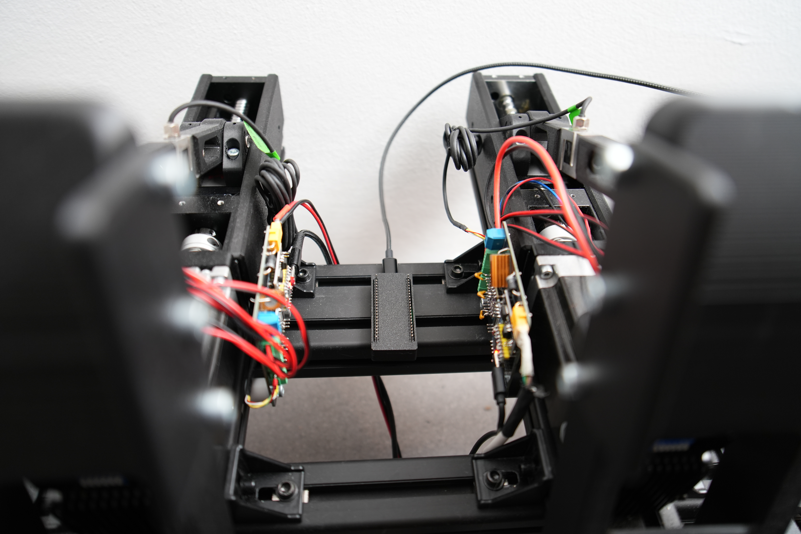
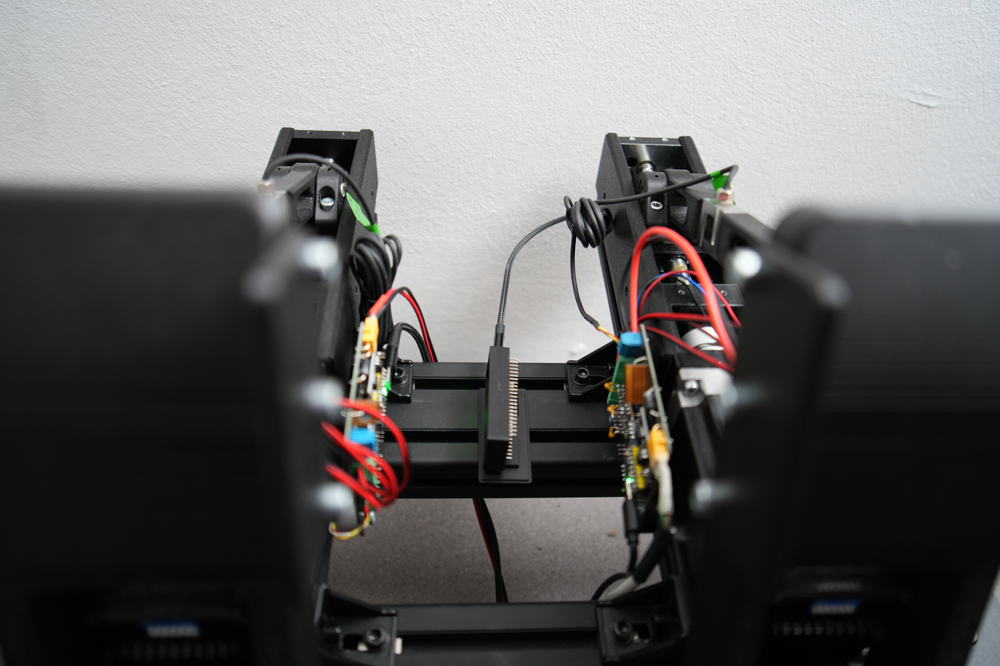
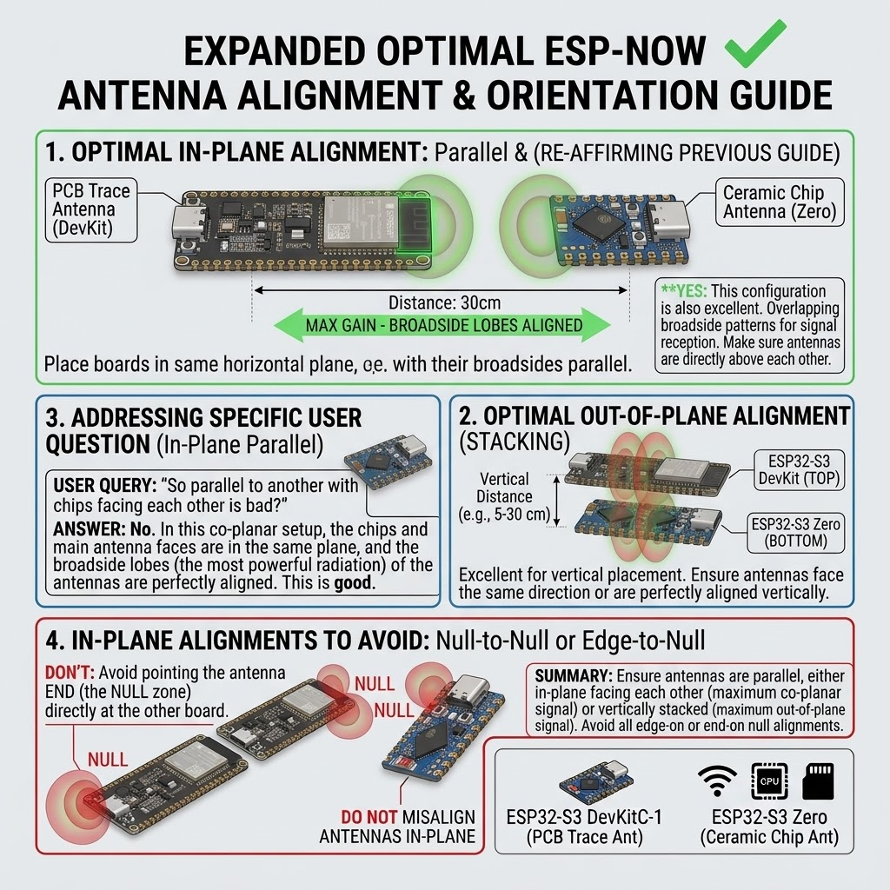
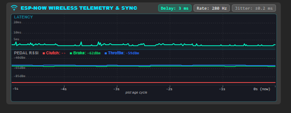
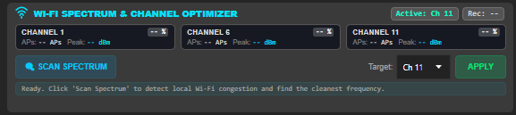

# ESP-NOW Wireless Placement Guide: PCBs & Bridge Module

To ensure ultra-low latency (~3 ms) and jitter-free communication at ~280 Hz over ESP-NOW, the physical placement and orientation of your pedal controller PCBs and the USB Bridge module are critical.

Target Signal Strength: **RSSI > -66 dBm** (e.g., between -33 dBm and -60 dBm).

---

## 1. Physical Placement & Polarization Alignment

Mount the central Bridge receiver centrally between your pedals so all antennas maintain an unobstructed, direct line-of-sight and share matching antenna polarization.

### Comparison: Cross-Polarized vs. Co-Polarized Bridge Mounting

| Configuration | Setup & Signal Impact | Recommendation |
| :--- | :--- | :--- |
| **Cross-Polarized** *(Bridge Horizontal, Pedal PCBs Vertical)* |  The bridge module is lying flat horizontally while the pedal PCBs are mounted vertically on the uprights (90° polarization mismatch). This causes **15 to 25 dB polarization attenuation**, lowering RSSI to ~-60 to -75 dBm and increasing susceptibility to multipath nulls. | ⚠️ **Suboptimal**: Prone to RF jitter and packet retries in high-interference environments. |
| **Co-Polarized** *(Bridge Vertical, Pedal PCBs Vertical)* |  The bridge module is mounted upright vertically, matching the exact plane of the pedal PCBs. Both broadside radiation lobes align, maximizing effective gain and yielding excellent signal strength (**~-33 to -45 dBm**). | ✅ **Recommended**: Delivers rock-solid wireless stability, lowest latency, and maximum SNR. |

---

### Key Mounting Guidelines:
- **Co-Polarized Alignment (Vertical Orientation)**: Always align the bridge module vertically when the pedal boards are mounted vertically on the uprights. Co-polarization avoids the 90° cross-polarization penalty.
- **Central Bridge Position**: Mount the Bridge module centered on the transverse profile between the pedals.
- **Inward-Facing PCBs**: Mount the pedal controller boards on the inner vertical sides of each pedal upright. This ensures the onboard antennas point directly toward the central bridge rather than through pedal mechanics.
- **Avoid Aluminum Profile Shielding**: Aluminum 8020/4040 extrusions block 2.4 GHz RF signals completely. Keep antennas positioned slightly clear of thick aluminum beams; never enclose the antenna inside an extrusion channel.
- **Keep Cable Bundles Clear of Antennas**: Keep heavy motor and power wires bundled behind the board so they do not shadow the RF path.

---

## 2. Antenna Alignment & Orientation Principles

ESP32-S3 boards (both PCB trace antennas on DevKit modules and ceramic chip antennas on Zero modules) have directional radiation lobes.

### Recommended Configurations:
1. **Parallel / Broadside Alignment (Best for Pedal Rigs)**:
   - Align the broadside faces of the antennas parallel to each other.
   - The broadside radiation lobe delivers maximum gain.
2. **Vertical Stacking (Out-Of-Plane)**:
   - When boards are stacked above or below one another, keep their faces aligned in the same orientation.

### Configurations to Avoid:
- ❌ **Null-to-Null Alignment**: Never point the very tip (top edge) of one ESP32 antenna directly at the tip of another board. The antenna tips are radiation null zones with significantly reduced gain.
- ❌ **Edge-on Null Alignment**: Avoid aligning boards perpendicular such that the edge points into the dead zone of the receiver.

---

## 3. Real-Time Verification in SimHub

Once installed, verify wireless connectivity directly in the SimHub plugin under the rudder tab and **ESP-NOW Wireless Telemetry & Sync** monitor.

### What to Look For:
| Metric | Healthy Target | Action Required if Degraded |
| :--- | :--- | :--- |
| **Pedal RSSI** | **> -66 dBm** (e.g., -33 to -60 dBm) | If below -66 dBm (e.g., -70 to -85 dBm), rotate or reposition the bridge module. |
| **Delay / Latency** | **~2 to 4 ms** | Check line-of-sight if latency spikes above 10 ms. |
| **Telemetry Rate** | **~280 Hz** | Sustained rate confirms zero dropped frames. |
| **Jitter** | **< ±0.5 ms** | Indicates clean RF environment without retransmission delays. |

---

## 4. 2.4 GHz Wi-Fi Interference & Dynamic Channel Switching

Even with optimal co-polarized antenna orientation and clear line-of-sight mounting, wireless latency or jitter can degrade if local 2.4 GHz home Wi-Fi networks (routers, mesh nodes, access points) broadcast heavily on the same radio frequency.

Under 802.11 CSMA/CA rules, ambient Wi-Fi traffic forces ESP-NOW to defer transmissions during Clear Channel Assessment (CCA), leading to latency spikes and packet delays.

To resolve this without needing to reflash firmware, SimHub provides a built-in **Wi-Fi Spectrum & Channel Optimizer** directly on the **Rudder** tab:

### Features & Live Feedback:
* **Active & Recommended Badges**: Instantly display the currently active channel and the cleanest frequency recommended by the latest scan.
* **3-Channel Congestion Cards (Channels 1, 6, 11)**: Shows detected AP count, peak RSSI (dBm), and a color-coded congestion percentage badge (Green $\le 25\%$, Orange $\le 60\%$, Red $> 60\%$).
* **Target Dropdown & Apply**: Choose any standard non-overlapping 2.4 GHz channel (Ch 1, 6, or 11) and click **Apply**.
* **Status Banner**: Real-time diagnostic guidance and scan recommendations.

### Step-by-Step Optimization Workflow:
1. Open the **RUDDER** tab in SimHub.
2. Under **WI-FI SPECTRUM & CHANNEL OPTIMIZER**, click **"🔍 Scan Spectrum"**.
3. Wait ~1 second while the ESP32 Master analyzes ambient RF traffic across 2.4 GHz channels.
4. Review the detected access points and congestion scores for Channels 1, 6, and 11.
5. The system automatically selects the cleanest recommended frequency in the **Target** dropdown.
6. Click **"Apply"**:
   * The Master broadcasts the new channel to all connected pedals over ESP-NOW.
   * Both the Master and Pedals switch frequencies simultaneously.
   * The new frequency is saved to EEPROM on all devices and preserved in SimHub settings, persisting across reboots and power cycles.
