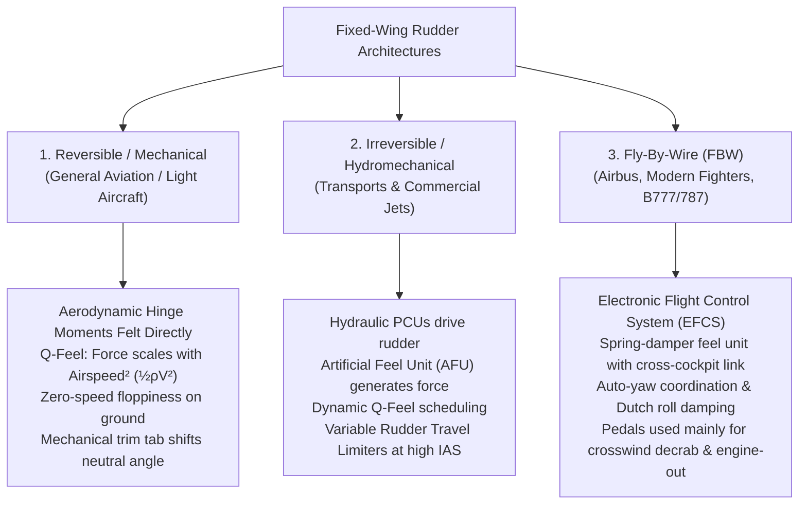
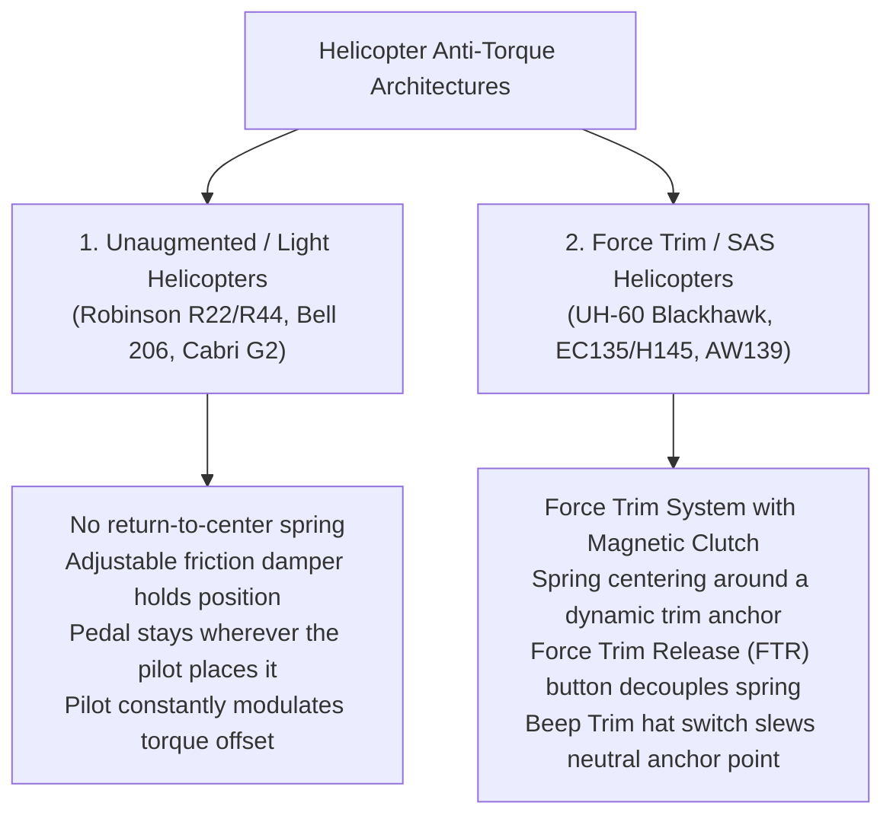

# Flight Rudder & Anti-Torque Pedal Dynamics: Real-World Aviation Principles & FFB Implementation Guide

This document provides a comprehensive theoretical and physical breakdown of rudder and anti-torque pedal systems in real-world aircraft (fixed-wing airplanes and rotary-wing helicopters). It establishes the physical and mathematical foundations required to implement realistic Force Feedback (FFB) modes, admittance control algorithms, and dual-pedal synchronization over ESP-NOW for the DIY Active Pedal.

---

## 1. Executive Summary & Fundamental Kinematics

### 1.1 The Mechanical Push-Pull Constraint
In virtually all real-world manned aircraft, the left and right rudder/anti-torque pedals are **rigidly interconnected** through a mechanical linkage (push-pull tubes, cable-and-pulley networks, or a central pivoting teeter-totter bar).

```text
                      [ Aircraft Yaw Axis / Rudder Surface ]
                                     ▲
                                     │  (Push-Pull Linkage / Cable / Fly-By-Wire)
                                     │
           [ Left Pedal ] ───► ───[ Pivot ]─── ◄─── [ Right Pedal ]
             (Push Forward)                         (Retracts Aft)
```

* **Anti-Symmetric Displacement**: Pushing the **left pedal forward** forces the **right pedal backward** by an equal and opposite displacement:
  $$\Delta x_{\text{right}} = -\Delta x_{\text{left}}$$
* **Dual-Pedal Resistance (Fighting Oneself)**: If a pilot pushes both feet forward simultaneously with equal force ($F_L = F_R$), the mechanical linkage prevents any net travel ($\Delta x = 0$). The pilot simply feels the rigid structural stiffness of the pedal chassis.
* **Single Degree of Freedom (Yaw)**: In contrast to sim racing (where throttle, brake, and clutch operate as independent 1-DOF mechanisms), aviation rudder pedals act as **one shared differential degree of freedom** distributed across two foot-plates.

---

### 1.2 The Two Distinct Axes: Yaw vs. Toe Brakes
Fixed-wing aircraft pedals feature **two independent axes of motion**:

```text
      [ Toe Brake Axis ] ──► (Tilts forward independently around ankle pivot)
            │
         ┌──┴──┐
         │ ┌─┐ │
         │ └─┘ │
         └──┬──┘
            │
      [ Yaw / Rudder Axis ] ──► (Whole assembly slides / swings push-pull)
```

| Axis | Mechanism | Motion Type | Coupling | Purpose |
|---|---|---|---|---|
| **Rudder / Yaw** | Sliding sled or parallelogram swing | Push-pull (opposing) | **Coupled**: Left forward $\leftrightarrow$ Right backward | Aerodynamic yaw control in flight; nosewheel/tailwheel steering during taxi |
| **Toe Brakes** | Angular tilt / footplate pivot on top of pedal | Independent forward tilt | **Uncoupled**: Left and right press independently | Differential main wheel braking for runway deceleration and tight ground turns |

> [!NOTE]
> **Helicopter Anti-Torque Pedals** almost never have toe brakes. They operate purely along the single yaw/collective-pitch axis.

---

### 1.3 Why Simultaneous Pressing Only Exists for Toe Brakes
A common point of confusion when transitioning from sim racing pedals to flight simulation is whether pressing both pedals simultaneously is a valid action.

```text
        YAW / RUDDER MOVEMENT                   WHEEL BRAKING (TOE BRAKES)
        (Sliding Push-Pull Axis)                 (Ankle-Tilt Pivot Axis)

      Left Pedal       Right Pedal             Left Pedal       Right Pedal
      ┌────────┐       ┌────────┐              ┌────────┐       ┌────────┐
      │   ▲    │       │   │    │              │  Tilt  │       │  Tilt  │
      │   │    │       │   ▼    │              │   /    │       │   /    │
      │  Push  │  <═>  │ Retract│              │  /     │  AND  │  /     │
      └────────┘       └────────┘              └────────┘       └────────┘
       Coupled (Anti-Symmetric)                Independent (Symmetric or Differential)
```

#### Real-World Operational Context:
1. **In Flight (Yaw / Aerodynamic Control)**:
   * Pushing both pedals forward simultaneously **never happens and serves no aerodynamic purpose**. 
   * The mechanical linkage physically locks any common-mode forward travel. Pilots rest their heels on the cockpit floor or pedal stirrups and apply force only to the intended side.
2. **On the Ground (Runway Deceleration & Engine Run-Ups)**:
   * The **ONLY** time both pedals are pushed forward simultaneously is when applying **wheel brakes** via the upper toe-tilt pivots.
   * **Symmetrical Braking**: Pressing both toes forward applies equal hydraulic pressure to both left and right main gear brakes (used during landing rollout, rejected takeoff, or holding stationary during engine run-up).
   * **Differential Braking**: Pressing only the left toe brakes the left main wheel, allowing tight castering turns during taxi.

#### The Sim Racing Hardware Dilemma (1-DOF vs. 2-DOF):
* **Real Aviation Pedals (2-DOF per pedal)**: Sled slides push-pull for yaw + upper plate tilts for brake.
* **DIY Active Sim Racing Pedals (1-DOF per pedal)**: Actuators provide single-axis linear travel along the sled.
* **Conclusion**: 
  * If configured in **Pure Rudder Mode**, pressing both pedals must be **physically blocked** by the virtual linkage (as implemented in PR #99).
  * If the user wishes to use single-axis pedals for both rudder and wheel braking without extra hardware, software-level emulation (such as dual-press force threshold detection) is required.

---

## 2. Fixed-Wing Aircraft Rudder Systems (Planes)

Fixed-wing rudder control dynamics differ fundamentally depending on the flight control architecture: **Mechanical Reversible Controls**, **Hydraulically Boosted / Irreversible Controls**, and **Fly-By-Wire (FBW)**.



---

### 2.1 Reversible / Mechanical Control Systems (General Aviation)
*Found in: Cessna 172/182, Piper PA-28, Beechcraft Bonanza, aerobatic aircraft, gliders.*

In mechanical systems, the pilot's feet are connected directly to the vertical rudder surface via stainless steel control cables or aluminum push-pull torque tubes.

#### Physical Characteristics:
1. **Dynamic Pressure Scaling ($Q$-Feel)**:
   The aerodynamic resistance felt at the pedals is directly proportional to the dynamic pressure $q = \frac{1}{2} \rho V^2$:
   $$F_{\text{aero}} \propto q \cdot S_{\text{rudder}} \cdot c_{\text{chord}} \cdot C_{h}(\delta_r, \beta)$$
   * **At 0 knots (on the ramp / hangar)**: The pedals feel very light, loose, and floppy with almost no centering force (only light internal return bungees or linkage friction).
   * **At high airspeed ($V_{\text{IAS}}$)**: The aerodynamic forces push strongly against deflection. Deflecting the rudder to maximum angle requires high foot effort (e.g., 200–500 N).
2. **Natural Aerodynamic Self-Centering**:
   When the pilot removes foot pressure in flight, the airflow over the vertical stabilizer naturally blows the rudder surface back into the slipstream ($C_{h\alpha} \cdot \beta + C_{h\delta} \cdot \delta_r = 0$), forcing the pedals back to the aerodynamic neutral point.
3. **Breakout Force & Friction**:
   Cable guide pulleys, fairleads, and hinge bearings introduce a baseline static breakout friction ($\approx 10\text{--}25\text{ N}$) that prevents small control flutter around zero deflection.
4. **Mechanical Trim Tabs**:
   A small movable tab at the trailing edge of the rudder surface deflects into the airflow, creating an aerodynamic moment that holds the entire rudder at a trimmed angle $\delta_{\text{trim}}$. This physically shifts the zero-force resting position of the pedals.
5. **Slipstream & P-Factor Asymmetry**:
   In propeller-driven aircraft, the clockwise-rotating prop creates a helical slipstream swirling around the fuselage and striking the left side of the vertical fin. During high-power / low-speed climb, the pilot must maintain continuous **right rudder pressure** unless trimmed out.

---

### 2.2 Hydraulically Boosted / Irreversible Systems
*Found in: Boeing 737 / 747 / 767, Bombardier CRJ, classic jet transports.*

In irreversible systems, hydraulic Power Control Units (PCUs) move the rudder surface. Because hydraulic actuators isolate the pilot from aerodynamic surface forces, an **Artificial Feel Unit (AFU)** must synthesize pedal feedback.

#### Physical Characteristics:
1. **Artificial Feel Unit (AFU) / Q-Feel Computer**:
   The AFU uses centering springs, cam profiles, and hydraulic/pneumatic pistons fed by pitot dynamic pressure ($q$) to simulate airspeed-dependent stiffness.
2. **Rudder Travel Limiter / Rudder Ratio Changer**:
   * At low speeds (takeoff/landing, $< 150\text{ kts}$), full rudder travel ($\pm 25^\circ\text{ to }\pm 30^\circ$) is available for crosswind control and engine failure yaw authority.
   * At high speeds ($> 250\text{ kts}$), aerodynamic loads would snap the vertical tail off if full deflection were applied. A mechanical limiter or hydraulic ratio changer restricts maximum pedal travel to as little as $\pm 2^\circ\text{ to }\pm 4^\circ$, creating **dynamically moving hard endstops**.
3. **Yaw Damper Interaction**:
   A yaw damper servo automatically injects rudder corrections to suppress Dutch roll oscillations. In some aircraft (e.g. B737), yaw damper inputs move the rudder surface without moving the pedals (series yaw damper); in others, pedals may slightly backdrive.
4. **Pedestal Rudder Trim**:
   A rotary trim knob on the center pedestal drives an electric trim actuator that physically shifts the neutral center of the AFU spring mechanism, moving both pedals to a new hands/feet-off equilibrium position.

---

### 2.3 Fly-By-Wire (FBW) Aircraft
*Found in: Airbus A320 / A330 / A350, Boeing 777 / 787, F-16, F/A-18, Rafale.*

In modern FBW aircraft, pedal positions are read by Rotary Variable Differential Transformers (RVDTs) and processed by Flight Control Computers (FCCs).

#### Physical Characteristics:
1. **Spring-Loaded Centering Gradient**:
   The pedals use a dual-rate or non-linear progressive spring feel unit. Centering force is constant or scheduled by flight mode:
   $$F_{\text{pedal}}(x) = F_{\text{breakout}} \cdot \text{sgn}(x) + K_1 \cdot x + K_2 \cdot x^3 + D \cdot \dot{x}$$
2. **Cross-Cockpit Mechanical Interconnect**:
   In Airbus aircraft, although the sidesticks are not mechanically linked between Captain and First Officer, the **rudder pedals ARE mechanically interconnected** across the cockpit via push-pull rods. If the Captain pushes left, the First Officer's left pedal moves forward and right pedal moves back.
3. **Flight Control Laws (Auto-Yaw Coordination)**:
   During normal flight, the fly-by-wire system automatically handles turn coordination and sideslip compensation. Pilots keep their feet flat on the floor during cruise. Rudder pedals are actively used only for:
   * Crosswind runway align / decrab during flare.
   * Engine failure (asymmetric thrust compensation).
   * Nosewheel steering during low-speed ground taxi ($< 20\text{ kts}$ via pedal steering ratio).

---

## 3. Rotary-Wing Aircraft Anti-Torque Systems (Helicopters)

Helicopter pedals control the pitch of the tail rotor blades (or Fenestron / NOTAR airflow) to counteract main rotor torque and provide yaw heading control.

> [!IMPORTANT]
> **The Fundamental Helicopter Difference: Non-Centering & Continuous Offset.**
> Unlike an airplane rudder (which naturally wants to streamline to aerodynamic center), a helicopter tail rotor requires **continuous non-zero thrust** to prevent the fuselage from spinning uncontrollably due to main rotor torque. 
> Therefore, helicopter pedals **do not snap back to a mechanical center** during normal operation.



---

### 3.1 Light / Unaugmented Helicopters (Friction-Held)
*Found in: Robinson R22 / R44, Bell 206 JetRanger, Schweizer 300, Guimbal Cabri G2.*

#### Physical Characteristics:
1. **Zero Centering Spring (Pure Friction / Damping)**:
   There is **no centering spring** pulling the pedals toward 50% travel. If the pilot takes their feet off the pedals, the pedals stay exactly where they were left (or drift slowly due to tail rotor aerodynamic feedback).
2. **Mechanical Friction Adjuster**:
   A mechanical friction knob on the cockpit floor applies a clamping friction force:
   $$F_{\text{resist}} = F_{\text{friction}} \cdot \text{sgn}(\dot{x}) + D \cdot \dot{x}$$
   This damps out foot tremors and prevents blade pitch forces from back-driving the pedals.
3. **Hover vs. Cruise Trim Positions**:
   * **In Hover**: Counteracting main rotor torque requires high tail rotor pitch. In counter-clockwise rotor systems (American helicopters like Robinson, Bell, Sikorsky), **significant left pedal** is held continuously.
   * **In High-Speed Forward Cruise**: The vertical tail fin unloads the tail rotor aerodynamically; the pedal position moves closer to neutral or slightly right.
   * **During Autorotation (Engine Failure)**: Rotor torque disappears instantly. The pilot must immediately stomp **full right pedal** to prevent violent left yaw.

---

### 3.2 Medium / Heavy Turbine Helicopters (Force Trim & SAS)
*Found in: Sikorsky UH-60 Black Hawk / S-70, Airbus Helicopters H135 / H145 / H225, Leonardo AW139, Boeing CH-47 Chinook.*

Advanced helicopters use hydraulic boosters and an electro-mechanical **Force Trim System** to provide artificial centering feel without fatiguing the pilot.

```text
       [ Spring Feel Unit ] ──► [ Magnetic Brake / Electro-Clutch ] ──► (Chassis Frame)
               │                                ▲
               ▼                                │  (Engaged = Rigid Anchor)
         [ Left Pedal ]                         │  (FTR Pressed = Free Float)
                                                ▼
                                    [ Pilot Cyclic/Pedal FTR Switch ]
```

#### Physical Characteristics:
1. **Magnetic Brake & Spring Gradient**:
   The pedal is connected to a centering spring pack whose base is anchored to an electro-magnetic clutch (magnetic brake). When the brake is energized, the spring provides a centering force around the current anchor point $x_{\text{trim}}$:
   $$F_{\text{pedal}} = -K_{\text{trim}} \cdot (x - x_{\text{trim}}) - D \cdot \dot{x}$$
2. **Force Trim Release (FTR) Workflow**:
   * In flight, the pilot wants to establish a new hover heading or airspeed.
   * The pilot presses and holds the **FTR (Force Trim Release)** button on the cyclic grip or pedal.
   * The magnetic brake de-energizes instantly $\rightarrow$ Spring base floats freely $\rightarrow$ Centering resistance drops to zero ($K_{\text{trim}} \to 0$).
   * The pilot repositions the pedals with light effort to the desired heading.
   * The pilot releases the FTR button $\rightarrow$ Magnetic brake locks instantly $\rightarrow$ The **new pedal position becomes the new zero-force center** ($x_{\text{trim}} \leftarrow x_{\text{current}}$).
3. **Beep Trim (4-Way Hat Switch)**:
   For fine adjustments in cruise, the pilot pushes a 4-way beep trim switch on the cyclic. A small electric trim actuator slowly slews the magnetic brake anchor position at a constant velocity:
   $$\frac{dx_{\text{trim}}}{dt} = \pm v_{\text{slew}} \quad (\approx 1\text{ to }3\% \text{ travel / sec})$$
4. **Yaw Stability Augmentation System (Yaw SAS)**:
   High-bandwidth hydraulic smart actuators inject micro-corrections ($\pm 5\text{ to }10\%$ authority) to stabilize yaw rate without back-driving the pilot's pedals.

---

## 4. Comprehensive Comparison: Airplanes vs. Helicopters

| Parameter | GA Mechanical Plane | FBW / Commercial Airliner | Light Helicopter (R22/R44) | Turbine Helicopter (Force Trim) |
|---|---|---|---|---|
| **Dual-Pedal Linkage** | Rigid Push-Pull ($x_R = -x_L$) | Rigid Push-Pull ($x_R = -x_L$) | Rigid Push-Pull ($x_R = -x_L$) | Rigid Push-Pull ($x_R = -x_L$) |
| **Centering Behavior** | Aerodynamic self-centering ($q \propto V^2$) | Artificial spring centering | **No centering** (stays where placed) | Centered around **dynamic magnetic brake anchor** |
| **Airspeed ($V_{\text{IAS}}$) Influence** | High (floppy at $0\text{ kts}$, stiff at $V_{\text{ne}}$) | High (Q-feel + travel limiters) | Negligible on pedal stiffness | Negligible on pedal stiffness |
| **Breakout Force** | Low to moderate ($10\text{--}25\text{ N}$) | High, distinct detent ($30\text{--}60\text{ N}$) | Near zero ($0\text{--}5\text{ N}$) | Moderate around trim point ($15\text{--}30\text{ N}$) |
| **Trim Mechanism** | Aerodynamic tab (shifts aero neutral) | Pedestal trim wheel (shifts spring) | Hand friction nut (holds pedal) | **FTR Button** (instant snap-anchor) + Beep Trim |
| **Toe Brakes** | Yes (differential main wheels) | Yes (differential main wheels) | **None** | **None** (or parking brake on wheeled helis) |
| **Engine-Out Behavior** | Large asymmetric yaw toward dead engine | Asymmetric yaw; trim required | Total loss of torque (stomp opposite pedal) | Total loss of torque (stomp opposite pedal) |

---

## 5. Mathematical Control Models for Active FFB Pedals

To translate real-world aviation physics into firmware, we define four core operational control modes built upon the 4 kHz Admittance Physics Engine.

```text
                      ┌──────────────────────────────────────────────┐
                      │            Active Pedal Firmware             │
                      │       4 kHz Admittance Controller           │
                      └──────────────────────┬───────────────────────┘
                                             │
             ┌───────────────────────────────┼───────────────────────────────┐
             ▼                               ▼                               ▼
    [ Fixed-Wing Plane ]            [ Light Helicopter ]            [ Turbine Helicopter ]
    ┌──────────────────────┐        ┌──────────────────────┐        ┌──────────────────────┐
    │ Mode 1: Aero Q-Feel  │        │ Mode 2: Pure Friction│        │ Mode 3: Force Trim   │
    │ Mode 4: FBW Constant │        │ (Non-Centering Damped│        │ (FTR + Dynamic Trim  │
    │ (Airspeed Scheduling)│        │  Position Hold)      │        │  Magnetic Brake)     │
    └──────────────────────┘        └──────────────────────┘        └──────────────────────┘
```

---

### 5.1 Dual-Pedal Admittance Synchronization (Coupled Equations of Motion)

When two DIY Active Pedals are linked over ESP-NOW, they form a single distributed virtual push-pull mechanism.

Let $x_L \in [0.0, 1.0]$ be the normalized displacement of the Left Pedal ($0.5 = \text{Center}$, $1.0 = \text{Full Forward}$, $0.0 = \text{Full Aft}$).
Let $x_R \in [0.0, 1.0]$ be the normalized displacement of the Right Pedal.

#### Ideal Kinematic Anti-Symmetry:
$$x_R(t) = 1.0 - x_L(t)$$

#### Coupled Admittance Dynamics:
For the Left Pedal, the net virtual acceleration $\ddot{x}_L$ is calculated as:
$$M_{\text{v}} \ddot{x}_L + C_{\text{v}} \dot{x}_L + K_{\text{centering}}(x_L - x_{\text{trim}}) = F_{\text{pilot}, L} - F_{\text{sync}, R} + F_{\text{opposing}} + F_{\text{aero}} + F_{\text{effects}}$$

Where:
* $F_{\text{pilot}, L}$: Force measured by the local load cell (in Newtons).
* $F_{\text{sync}, R}$: Force measured by the opposite pedal received over ESP-NOW.
* $F_{\text{opposing}}$: Virtual rigid-link reaction force when the pilot presses both pedals simultaneously:
  $$\Delta x_{\text{error}} = (x_L + x_R) - 1.0$$
  $$F_{\text{opposing}} = -K_{\text{link}} \cdot \Delta x_{\text{error}} - D_{\text{link}} \cdot (\dot{x}_L + \dot{x}_R)$$
  *(When both feet press forward, $\Delta x_{\text{error}} > 0$, generating an immense restoring force that stops forward travel immediately).*

---

### 5.2 Mode 1: Fixed-Wing Reversible (Aerodynamic Q-Feel)

Simulates General Aviation aircraft where stiffness and travel limits scale dynamically with flight telemetry ($V_{\text{IAS}}$).

```text
                      Force (N)
                         ▲
                         │              High Airspeed (V = 160 kts)
                         │                 /
                         │                /  Medium Airspeed (V = 80 kts)
                         │               /  /
                         │              /  /   Zero Speed / Ramp (V = 0 kts)
                         │             /  /   /
                         │            /  /  _───
                         ├───────────/──/───    ───► Pedal Travel (x)
                        -x_max      0 (Center)   +x_max
```

#### Mathematical Formulation:
1. **Dynamic Centering Stiffness**:
   $$K(V_{\text{IAS}}) = K_{\text{min}} + K_{\text{aero}} \cdot \left( \frac{V_{\text{IAS}}}{V_{\text{ref}}} \right)^2$$
   * At $V_{\text{IAS}} = 0$: $K = K_{\text{min}}$ (light mechanical centering spring).
   * At high airspeed: $K$ increases quadratically up to $K_{\text{max}}$.
2. **Dynamic Travel Limiting (Variable Hard Endstops)**:
   $$x_{\text{travel, max}}(V_{\text{IAS}}) = \begin{cases} 
   x_{\text{full}}, & V_{\text{IAS}} \le V_{\text{corner}} \\
   x_{\text{full}} \cdot \left( \frac{V_{\text{corner}}}{V_{\text{IAS}}} \right), & V_{\text{IAS}} > V_{\text{corner}}
   \end{cases}$$
3. **Aerodynamic Trim Offset**:
   $$x_{\text{neutral}} = 0.5 + x_{\text{trim\_offset}}$$
   $$F_{\text{centering}} = -K(V_{\text{IAS}}) \cdot (x_L - x_{\text{neutral}})$$

---

### 5.3 Mode 2: Fixed-Wing FBW / Constant Spring Gradient

Simulates modern airliners and jet transports with constant mechanical spring feel units, high breakout force, and electronic damping.

#### Mathematical Formulation:
$$F_{\text{feel}}(x) = -\left[ F_{\text{breakout}} \cdot \text{sgn}(x - x_{\text{trim}}) + K_1 (x - x_{\text{trim}}) + K_3 (x - x_{\text{trim}})^3 \right] - D_{\text{viscous}} \cdot \dot{x}$$

* **Breakout Detent**: Requires an initial $20\text{--}40\text{ N}$ to leave center, preventing unintended rudder inputs during manual flight.
* **Cubic Stiffness ($K_3$)**: Progressive force ramp-up near end of travel.

---

### 5.4 Mode 3: Helicopter Pure Friction (Non-Centering Position Hold)

Simulates light helicopters (e.g. R22/R44) with zero return-to-center spring and adjustable mechanical friction clamping.

```text
                      Force (N)
                         ▲
                         │     ┌─────────────────── (+F_friction when moving forward)
                         │     │
                         ├─────┼───────────────────► Velocity (v)
                         │     │
      (-F_friction when ─┴─────┘
       moving aft)
```

#### Mathematical Formulation:
1. **Zero Centering Stiffness**:
   $$K_{\text{centering}} = 0.0$$
2. **Coulomb Friction & Viscous Damping**:
   $$F_{\text{damping}} = -D_{\text{heli}} \cdot \dot{x}$$
   $$F_{\text{friction}} = -F_{\text{coulomb}} \cdot \tanh\left( \frac{\dot{x}}{v_{\epsilon}} \right)$$
3. **Result**: When the pilot moves the pedal to 35% travel and lets go ($\dot{x} = 0$, $F_{\text{pilot}} = 0$), the net acceleration is zero ($\ddot{x} = 0$). The pedal **remains locked at 35% travel indefinitely**.

---

### 5.5 Mode 4: Helicopter Force Trim (Magnetic Brake & FTR)

Simulates turbine helicopters (e.g. UH-60, H145) with electro-magnetic clutch trim release.

```mermaid
stateDiagram-v2
    [*] --> Trimmed_Hold: System Active
    
    Trimmed_Hold --> FTR_Free_Float: Pilot Holds FTR Switch (Button Down)
    FTR_Free_Float --> Trimmed_Hold: Pilot Releases FTR Switch (Button Up)
    
    state Trimmed_Hold {
        direction LR
        Magnetic_Brake: LOCKED
        Centering_Spring: Active around x_trim
        Feel: Spring Resistance
    }
    
    state FTR_Free_Float {
        direction LR
        Magnetic_Brake: RELEASED
        Centering_Spring: ZERO (x_trim tracks current pos)
        Feel: Pure Light Damping
    }
```

#### Mathematical Formulation:
Let $S_{\text{FTR}} \in \{0, 1\}$ be the state of the Force Trim Release button:

$$\begin{cases}
\text{If } S_{\text{FTR}} = 1 \text{ (Pressed)}: & K_{\text{trim}} = 0.0, \quad x_{\text{trim}}(t) = x_{\text{current}}(t) \\
\text{If } S_{\text{FTR}} = 0 \text{ (Released)}: & K_{\text{trim}} = K_{\text{nominal}}, \quad x_{\text{trim}} = \text{const} \quad (\text{locked at moment of release})
\end{cases}$$

#### Beep Trim Slew Rate:
When the pilot pulses the Beep Trim hat switch:
$$x_{\text{trim}}(t + \Delta t) = \text{constrain}\left( x_{\text{trim}}(t) + v_{\text{beep}} \cdot \Delta t \cdot \text{Dir}_{\text{hat}}, \; 0.05, \; 0.95 \right)$$

---

## 6. Flight Simulation Tactile & Environmental Effects

Beyond kinematic centering and friction, the active FFB pedal injects tactile cueing from flight simulator telemetry (MSFS, DCS, X-Plane, IL-2 via SimHub):

```text
       [ Flight Sim Telemetry ] ──► [ SimHub DAP Plugin ] ──► [ ESP32 4 kHz Admittance Engine ]
          ├─ Airspeed (IAS)            └─ Compute Effects        └─ High-Frequency Haptic Layer:
          ├─ Angle of Attack (AoA)                                    ├─ Stall Buffet Vibration
          ├─ Sideslip (Beta)                                          ├─ Ground Roll Rumble
          ├─ Engine RPM / Torque                                      ├─ Asymmetric Engine Kick
          └─ Wheel Speed (Gnd)                                        └─ Weapon Recoil Jolt
```

| Effect | Physical Cause | Waveform / Synthesis | Frequency |
|---|---|---|---|
| **Stall / Rudder Buffet** | Separated turbulent airflow from wing root or high AoA striking the vertical fin | Band-limited pink noise / harmonic oscillation modulated by $(\text{AoA} - \text{AoA}_{\text{crit}})$ | $12\text{--}28\text{ Hz}$ |
| **Ground Roll Rumble** | Runway tarmac texture and centerline expansion joints felt through nosewheel linkage | Amplitude-modulated white noise scaling with ground speed $V_{\text{ground}}$ | $20\text{--}65\text{ Hz}$ |
| **Engine Failure Kick** | Sudden loss of thrust on one wing creating immediate asymmetric yaw moment | Instantaneous step force impulse ($F_{\text{kick}} \propto \text{Thrust}_{\text{dead}}$) | Single impulse + DC offset |
| **Helicopter ETL Shudder** | Effective Translational Lift transition ($16\text{--}24\text{ kts}$) rotor wake boundary | Low-frequency sinusoidal beat frequency matching rotor blade passage ($N \times \Omega$) | $14\text{--}22\text{ Hz}$ |
| **Gunfire Recoil Jolt** | Nose-mounted cannon firing (e.g. A-10 GAU-8, F-16 M61) producing severe airframe shudder | High-amplitude pulse train matching gun rate-of-fire | $50\text{--}70\text{ Hz}$ |

---

## 7. Toe Brake Emulation Strategies for Single-Axis Hardware

Because DIY active pedals currently operate as single-axis linear actuators (one motor per pedal), simulating both **Yaw (differential push-pull)** and **Toe Brakes (independent tilt)** on the same pair of pedals requires thoughtful software mapping:

```text
                                 [ Dual Active Pedals ]
                                            │
                    ┌───────────────────────┴───────────────────────┐
                    ▼                                               ▼
         [ Approach A: Dedicated Modes ]                [ Approach B: Split Travel ]
         ├─ Flight Mode: Coupled Yaw                    ├─ First 50% Travel: Linked Yaw (Opposing)
         └─ Taxi/Brake Mode: Independent Brakes         └─ Top 50% Travel / Force Threshold: Toe Brake
```

### Strategy Options:

1. **Option A: Pure Rudder Mode (Recommended for Dedicated Setups & Realism)**:
   * Pedals operate exclusively as coupled anti-symmetric yaw pedals.
   * Pressing both pedals simultaneously is completely blocked by the virtual mechanical linkage (as implemented in PR #99).
   * Wheel braking is mapped to a dedicated hand lever, joystick button, or an external analog axis.
2. **Option B: Force-Threshold Dual Press Detection (Hybrid Taxi Braking)**:
   * **Differential Push-Pull ($F_L 
eq F_R$)**: System behaves as pure linked rudder.
   * **Simultaneous Press ($F_L > F_{\text{thresh}}$ AND $F_R > F_{\text{thresh}}$, e.g. $> 80\text{ N}$)**: The firmware recognizes that the pilot is applying symmetrical braking. It temporarily decouples the yaw link or outputs symmetrical Left/Right Brake axis commands to the flight simulator proportional to the applied force.
3. **Option C: Hardware 3-Axis Upgrade**:
   * Mechanical sub-assembly adding an angular load-cell pivot on top of the pedal faceplate for independent toe-brake axes.

---

## 8. Proposed Firmware Architecture & Configuration Data Structures

To support these real-world modes in the firmware and SimHub plugin, the following configuration architecture is recommended for subsequent implementation:

### 8.1 Flight Mode Enumeration
```cpp
typedef enum {
  RUDDER_FLIGHT_MODE_DISABLED_E = 0,
  RUDDER_FLIGHT_MODE_PLANE_REVERSIBLE_E = 1,    // GA / Aerodynamic Q-feel (quad-speed scaling)
  RUDDER_FLIGHT_MODE_PLANE_FBW_AIRLINER_E = 2,  // Constant spring gradient + high breakout
  RUDDER_FLIGHT_MODE_HELI_FRICTION_E = 3,       // Light helis (pure friction, zero centering)
  RUDDER_FLIGHT_MODE_HELI_FORCE_TRIM_E = 4      // Turbine helis (dynamic magnetic brake + FTR)
} RudderFlightMode_e;
```

### 8.2 Proposed Configuration Payload (`PayloadRudderConfig_t`)
```cpp
typedef struct __attribute__((packed)) {
  uint8_t  flightMode_u8;            // RudderFlightMode_e
  uint8_t  virtualLinkStiffness_u8;  // Interconnect rigidity (0-100%)
  uint8_t  breakoutForce_N_u8;       // Center breakout detent force (0-100 N)
  uint8_t  baseCenteringStiffness_u8;// Zero-airspeed / base centering (N/mm)
  uint8_t  aeroQGain_u8;             // Speed-squared stiffness scaling factor
  uint8_t  viscousDamping_u8;        // Hydraulic / airflow damping (0-100%)
  uint8_t  coulombFriction_u8;       // Mechanical friction clamping (0-100 N)
  uint8_t  ftrReleaseSlewRate_u8;    // Heli FTR anchor slew speed (mm/s)
  uint16_t dynamicTravelLimit_pct_u16;// Speed-dependent travel stop limit (0-10000 -> 0.0-100.0%)
} PayloadRudderConfig_t;
```

### 8.3 ESP-NOW Real-Time Synchronization State (`PayloadRudderState_t`)
```cpp
typedef struct __attribute__((packed)) {
  uint16_t pedalPosition_u16;       // 0 - 65535 absolute position
  float    pedalPositionRatio_fl32;  // 0.0 - 1.0 normalized position
  float    pedalForce_N_fl32;        // Instantaneous load cell force (Newtons)
  float    pedalVelocity_mps_fl32;   // Current pedal velocity (m/s)
  uint8_t  forceTrimState_u8;        // Bit 0: FTR active, Bit 1: Beep trim active
} PayloadRudderState_t;
```

---

## 9. Summary & Next Steps for Implementation

1. **Dual-Pedal Kinematic Coupling**: Use PR #99's force-sync foundation to establish the complete anti-symmetric admittance model ($x_R = 1.0 - x_L$ with $K_{\text{link}}$ opposing force).
2. **Flight Mode Dispatcher**: Implement a mode-selectable admittance stage in `StepperMovementStrategy.h` branching between Plane Reversible (Q-feel), Plane FBW (spring+breakout), Heli Friction (non-centering), and Heli Force Trim (FTR-anchored).
3. **Telemetry Ingestion**: Extend SimHub plugin to pass telemetry parameters ($V_{\text{IAS}}$, AoA, engine state, FTR button states) down to the ESP32 via USB and ESP-NOW.
